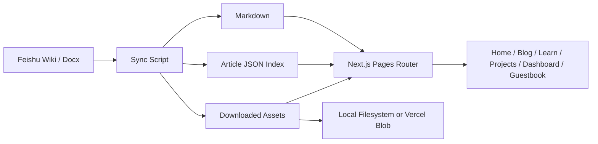

<h1 align="center">Feishu NextJS Blog</h1>

<p align="center">
  <a href="https://github.com/BlackishGreen33/Feishu-NextJS-Blog"></a>
  <a href="./LICENSE"></a>
  <a href="https://nextjs.org/"></a>
  <a href="https://react.dev/"></a>
  <a href="https://www.typescriptlang.org/"></a>
  <a href="https://tailwindcss.com/"></a>
  <a href="https://open.feishu.cn/"></a>
  <a href="https://vercel.com/docs/vercel-blob"></a>
</p>

<p align="center">
  <a href="./README.md">繁體中文</a> · <a href="./README.zh-CN.md">简体中文</a> · English
</p>

<p align="center">
  A multilingual Next.js content site powered by Feishu as the authoring source, built around a sync-first pipeline instead of embedding Feishu pages directly in the frontend.
</p>

<p align="center">
  <a href="https://blog.blackishgreen.dpdns.org">Live Site</a>
  ·
  <a href="https://blackishgreen.vercel.app">Vercel Deployment</a>
  ·
  <a href="#highlight">Highlight</a>
  ·
  <a href="#architecture">Architecture</a>
  ·
  <a href="#quick-start">Quick Start</a>
  ·
  <a href="#deployment">Deployment</a>
</p>

<p align="center">
  
</p>

> [!IMPORTANT]
> This project is built around `Feishu Wiki / Docx -> Markdown + Article JSON + Assets -> Next.js Rendering`. Content is synced and normalized before render time instead of embedding Feishu pages directly in the frontend.

## Why This Project

Teams that use document platforms as a CMS usually run into the same problems:

- embedding third-party docs in the frontend limits SEO, styling control and loading performance
- homepage, list pages and detail pages drift apart because they do not share one normalized content model
- assets, attachments, frontmatter, internal links and locale-aware routing are often left inconsistent

This repository exists to show a more production-oriented approach: keep Feishu as the writing surface, but give the Next.js site its own content model, asset pipeline and deployment strategy.

## Highlight

- Uses a Feishu knowledge base space as the content source through official APIs
- Converts Feishu block JSON into Markdown with `feishu-docx`
- Downloads images and attachments, then rewrites them into site-renderable assets
- Uses one normalized `Article` model across the homepage, blog list and article detail pages
- Supports `zh-TW`, `zh-CN`, and `en` locales with canonical and alternate SEO setup
- Includes article search, command palette search, and `Cmd/Ctrl + K` shortcuts
- Ships with Home, Dashboard, Projects, Blog, Learn, About, Contact, Guestbook, and Playground pages
- Supports optional Firebase-powered guestbook and chat widget flows
- Switches between local filesystem storage and Vercel Blob
- Runs scheduled sync jobs through Vercel Cron instead of querying Feishu directly at request time

## Architecture



## Tech Stack

| Layer                | Stack                                       |
| -------------------- | ------------------------------------------- |
| Framework            | Next.js 16, React 19, TypeScript            |
| Styling              | Tailwind CSS 4, Framer Motion, next-themes  |
| Content              | Feishu Open API, `feishu-docx`, gray-matter |
| Data Fetching        | SWR, Axios                                  |
| Storage              | Local filesystem, Vercel Blob               |
| Interactive Features | Firebase, command palette, JS playground    |
| Quality Gates        | ESLint, Prettier, TypeScript, Jest          |

## Project Layout

```text
.
├── data/feishu-blog/           # synced article index and generated article JSON
├── public/feishu-assets/       # downloaded covers and article assets
├── scripts/                    # sync and repository utilities
├── src/
│   ├── common/                 # shared config, layout, hooks, stores and helpers
│   ├── modules/                # page-level feature modules
│   ├── pages/                  # Next.js routes and API endpoints
│   └── server/blog/            # Feishu sync, storage and repository logic
├── README.md
├── README.zh-CN.md
└── README.en.md
```

## Quick Start

### 1. Install dependencies

```bash
pnpm install
```

### 2. Create local environment variables

```bash
cp .env.example .env.local
```

At minimum, configure these Feishu sync variables:

```bash
NEXT_PUBLIC_SITE_URL=http://localhost:3000
SITE_URL=http://localhost:3000
IMAGE_REMOTE_HOSTS=

FEISHU_APP_ID=
FEISHU_APP_SECRET=
FEISHU_SPACE_ID=
```

### 3. Sync content from Feishu

```bash
pnpm feishu:sync
```

If Feishu credentials are missing, the app falls back to the example data already committed in the repository.

### 4. Start the development server

```bash
pnpm dev
```

When Feishu credentials are configured, `predev` attempts one sync before the app boots.

## Environment Variables

| Variable                                                                | Required | Purpose                                                      |
| ----------------------------------------------------------------------- | -------- | ------------------------------------------------------------ |
| `NEXT_PUBLIC_SITE_URL`                                                  | Yes      | Public site URL used by SEO, sitemap and links               |
| `SITE_URL`                                                              | Yes      | Server-side canonical URL fallback                           |
| `FEISHU_APP_ID`                                                         | Yes      | Feishu app credential                                        |
| `FEISHU_APP_SECRET`                                                     | Yes      | Feishu app credential                                        |
| `FEISHU_SPACE_ID`                                                       | Yes      | Target Feishu knowledge base space                           |
| `BLOB_READ_WRITE_TOKEN`                                                 | Optional | Enable Vercel Blob in production                             |
| `CRON_SECRET`                                                           | Optional | Protect the cron sync endpoint                               |
| `NEXT_PUBLIC_FIREBASE_*`                                                | Optional | Enable guestbook and chat widget flows                       |
| `FIREBASE_ADMIN_*`                                                      | Optional | Enable the guestbook API layer and server-side verification  |
| `GUESTBOOK_ADMIN_UIDS`                                                  | Optional | UID allowlist for hide/delete controls on the guestbook page |
| `IMAGE_REMOTE_HOSTS`                                                    | Optional | Extra remote image hosts to allow                            |
| `CONTACT_FORM_API_KEY`                                                  | Optional | Contact form delivery key                                    |
| `DEVTO_KEY`                                                             | Optional | dev.to read API key                                          |
| `GITHUB_READ_USER_TOKEN_PERSONAL`                                       | Optional | GitHub GraphQL read token                                    |
| `SPOTIFY_CLIENT_ID` / `SPOTIFY_CLIENT_SECRET` / `SPOTIFY_REFRESH_TOKEN` | Optional | Spotify now playing and device data                          |
| `WAKATIME_API_KEY`                                                      | Optional | WakaTime stats                                               |
| `MINIMAX_SYSTEM_PROMPT`                                                 | Optional | System prompt override for Command Palette AI                |

## Content Workflow

### Frontmatter

Each Feishu document can start with YAML frontmatter:

```yaml
---
slug: feishu-sync-architecture
title: Feishu Sync Architecture
date: 2026-04-17
tags: [Feishu, Next.js]
summary: This article shows how to sync a Feishu knowledge base into Markdown and render it cleanly with Next.js.
cover: https://example.com/cover.png
featured: true
draft: false
---
```

### Supported fields

- `slug`
- `title`
- `date`
- `tags`
- `summary`
- `cover`
- `featured`
- `draft`

When a field is missing, the sync pipeline falls back to document metadata, edit time, generated summary, or the first usable image.

### What the sync step produces

- normalized article metadata shared by list and detail pages
- rewritten internal article links
- downloaded covers and inline assets
- Markdown content ready for `react-markdown`

## Performance Audit Targets

Recommended public URLs for fresh audits:

- Primary domain: [https://blog.blackishgreen.dpdns.org](https://blog.blackishgreen.dpdns.org)
- Stable deployment target: [https://blackishgreen.vercel.app](https://blackishgreen.vercel.app)

One-click audit entry points:

- Primary domain
  - [PageSpeed Insights](https://pagespeed.web.dev/analysis?url=https%3A%2F%2Fblog.blackishgreen.dpdns.org%2F&form_factor=desktop)
  - [GTmetrix](https://gtmetrix.com/?url=https%3A%2F%2Fblog.blackishgreen.dpdns.org%2F)
- Stable deployment target
  - [PageSpeed Insights](https://pagespeed.web.dev/analysis?url=https%3A%2F%2Fblackishgreen.vercel.app%2F&form_factor=desktop)
  - [GTmetrix](https://gtmetrix.com/?url=https%3A%2F%2Fblackishgreen.vercel.app%2F)

> [!NOTE]
> External performance reports drift over time and are sensitive to location, DNS, CDN behavior, and bot protection, so this README focuses on stable audit entry points and target URLs instead of pinning a score screenshot that will quickly go stale. If your network cannot resolve the custom domain consistently, use the Vercel deployment target for a cleaner rerun.

## Validation

Run these checks before shipping changes:

```bash
pnpm lint
pnpm typecheck
pnpm test
pnpm build
```

Useful scripts:

- `pnpm dev`
- `pnpm feishu:sync`
- `pnpm lint`
- `pnpm lint:fix`
- `pnpm typecheck`
- `pnpm test`
- `pnpm build`

## Deployment

### Vercel

The repository already includes a cron job in `vercel.json`:

- Endpoint: `/api/cron/feishu-sync`
- Default schedule: every 6 hours

Recommended production configuration:

- Feishu app credentials
- `BLOB_READ_WRITE_TOKEN`
- `CRON_SECRET`
- public site URL variables

## Acknowledgements

- [Feishu Open Platform](https://open.feishu.cn/)
- [`feishu-docx`](https://www.npmjs.com/package/feishu-docx)
- [Next.js](https://nextjs.org/)
- [Vercel](https://vercel.com/)

## License

This repository is licensed under [GPL-3.0](./LICENSE).
