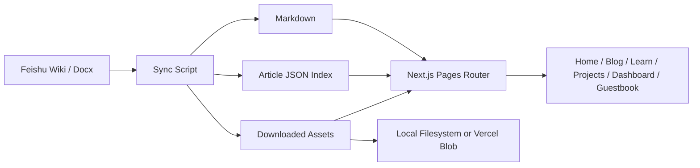

<h1 align="center">Feishu NextJS Blog</h1>

<p align="center">
  <a href="https://github.com/BlackishGreen33/Feishu-NextJS-Blog"></a>
  <a href="./LICENSE"></a>
  <a href="https://nextjs.org/"></a>
  <a href="https://react.dev/"></a>
  <a href="https://www.typescriptlang.org/"></a>
  <a href="https://tailwindcss.com/"></a>
  <a href="https://open.feishu.cn/"></a>
  <a href="https://vercel.com/docs/vercel-blob"></a>
</p>

<p align="center">
  繁體中文 · <a href="./README.zh-CN.md">简体中文</a> · <a href="./README.en.md">English</a>
</p>

<p align="center">
  一個以飛書知識庫為內容來源的 Next.js 多語內容站範例，採用「同步後渲染」而不是前台直接嵌入飛書頁面。
</p>

<p align="center">
  <a href="https://blog.blackishgreen.dpdns.org">Live Site</a>
  ·
  <a href="https://blackishgreen.vercel.app">Vercel Deployment</a>
  ·
  <a href="#亮點">亮點</a>
  ·
  <a href="#架構">架構</a>
  ·
  <a href="#快速開始">快速開始</a>
  ·
  <a href="#部署">部署</a>
</p>

<p align="center">
  
</p>

> [!IMPORTANT]
> 這個專案的核心設計是 `Feishu Wiki / Docx -> Markdown + Article JSON + Assets -> Next.js Rendering`。內容會先同步並標準化，再交給站點渲染，而不是把飛書頁面直接嵌進前端。

## 為什麼做這個專案

大多數以文檔平台作為內容來源的站點，最終都會遇到幾個問題：

- 前台直接嵌入第三方文檔，SEO、樣式控制與載入體驗都受限
- 內容結構散落在不同頁面，首頁、列表頁與詳情頁很難共用同一套資料模型
- 圖片、附件、frontmatter、內鏈與多語路由往往沒有被妥善標準化

這個專案的目標，是提供一個更工程化的實作方式：保留飛書作為寫作入口，同時讓 Next.js 站點保有自己的內容模型、資產管線與部署策略。

## 亮點

- 以飛書知識庫空間作為內容來源，透過官方 API 同步 Wiki / Docx 內容
- 使用 `feishu-docx` 將 block JSON 轉為 Markdown，並保留圖片與附件下載能力
- 以標準化 `Article` 模型供首頁、部落格列表與文章詳情頁共用
- 支援 `zh-TW`、`zh-CN`、`en` 三語路由與對應的 canonical / alternate SEO 配置
- 內建文章搜索、命令面板搜索與 `Cmd/Ctrl + K` 快捷入口
- 站點包含首頁、Dashboard、Projects、Blog、Learn、About、Contact、Guestbook、Playground
- Guestbook / Chat Widget 可選配 Firebase Realtime Database
- 支援本地文件存儲與 Vercel Blob 兩種資產後端
- 透過 Vercel Cron 執行定時同步，避免前台請求時直連飛書

## 架構



## 技術棧

| 層級                 | 技術                                        |
| -------------------- | ------------------------------------------- |
| Framework            | Next.js 16, React 19, TypeScript            |
| Styling              | Tailwind CSS 4, Framer Motion, next-themes  |
| Content              | Feishu Open API, `feishu-docx`, gray-matter |
| Data Fetching        | SWR, Axios                                  |
| Storage              | Local filesystem, Vercel Blob               |
| Interactive Features | Firebase, command palette, JS playground    |
| Quality Gates        | ESLint, Prettier, TypeScript, Jest          |

## 專案結構

```text
.
├── data/feishu-blog/           # 同步後的文章索引與文章 JSON
├── public/feishu-assets/       # 下載後的封面圖與文內資產
├── scripts/                    # 同步與倉庫工具腳本
├── src/
│   ├── common/                 # 共用配置、版面、hooks、stores、UI helpers
│   ├── modules/                # 頁面級功能模組
│   ├── pages/                  # Next.js 路由與 API 端點
│   └── server/blog/            # 飛書同步、存儲與資料倉儲邏輯
├── README.md
├── README.zh-CN.md
└── README.en.md
```

## 快速開始

### 1. 安裝依賴

```bash
pnpm install
```

### 2. 建立本地環境變數

```bash
cp .env.example .env.local
```

至少需要配置以下飛書同步相關變數：

```bash
NEXT_PUBLIC_SITE_URL=http://localhost:3000
SITE_URL=http://localhost:3000

FEISHU_APP_ID=
FEISHU_APP_SECRET=
FEISHU_SPACE_ID=
FEISHU_SYNC_TTL_SECONDS=600
```

### 3. 從飛書同步內容

```bash
pnpm feishu:sync
```

如果本地沒有飛書憑證，應用會回退到倉庫裡已提交的範例資料。

### 4. 啟動開發伺服器

```bash
pnpm dev
```

當飛書憑證已配置完成時，`predev` 會在啟動前先嘗試同步一次內容。

## 環境變數

| 變數                      | 必填     | 用途                                  |
| ------------------------- | -------- | ------------------------------------- |
| `NEXT_PUBLIC_SITE_URL`    | Yes      | SEO、sitemap 與公開鏈接使用的站點 URL |
| `SITE_URL`                | Yes      | 伺服器端 canonical URL 的兜底值       |
| `FEISHU_APP_ID`           | Yes      | 飛書應用憑證                          |
| `FEISHU_APP_SECRET`       | Yes      | 飛書應用憑證                          |
| `FEISHU_SPACE_ID`         | Yes      | 目標飛書知識庫 space                  |
| `FEISHU_SYNC_TTL_SECONDS` | No       | 同步快取 TTL                          |
| `BLOB_READ_WRITE_TOKEN`   | Optional | 在生產環境啟用 Vercel Blob            |
| `CRON_SECRET`             | Optional | 保護定時同步端點                      |
| `NEXT_PUBLIC_FIREBASE_*`  | Optional | 啟用 guestbook 與 chat widget 功能    |

## 內容工作流

### Frontmatter

每篇飛書文件都可以在頂部寫 YAML frontmatter：

```yaml
---
slug: feishu-sync-architecture
title: 飛書同步架構說明
date: 2026-04-17
tags: [Feishu, Next.js]
summary: 這篇文章展示了如何把飛書知識庫同步為 Markdown，並由 Next.js 正常渲染。
cover: https://example.com/cover.png
featured: true
draft: false
---
```

### 支援欄位

- `slug`
- `title`
- `date`
- `tags`
- `summary`
- `cover`
- `featured`
- `draft`

如果某些欄位缺失，同步管線會回退到文件中繼資料、編輯時間、自動摘要或第一張可用圖片。

### 同步後會產出什麼

- 用於列表頁與詳情頁的標準化文章中繼資料
- 已重寫的文章內鏈
- 下載後的封面圖與文內資產
- 可直接交給 `react-markdown` 渲染的 Markdown 內容

## 性能審核入口

如果你想跑一版新的外部性能測試，建議使用以下公開 URL：

- 主域名：[https://blog.blackishgreen.dpdns.org](https://blog.blackishgreen.dpdns.org)
- 穩定部署域名：[https://blackishgreen.vercel.app](https://blackishgreen.vercel.app)

一鍵測評入口：

- 主域名
  - [PageSpeed Insights](https://pagespeed.web.dev/analysis?url=https%3A%2F%2Fblog.blackishgreen.dpdns.org%2F&form_factor=desktop)
  - [GTmetrix](https://gtmetrix.com/?url=https%3A%2F%2Fblog.blackishgreen.dpdns.org%2F)
- 穩定部署域名
  - [PageSpeed Insights](https://pagespeed.web.dev/analysis?url=https%3A%2F%2Fblackishgreen.vercel.app%2F&form_factor=desktop)
  - [GTmetrix](https://gtmetrix.com/?url=https%3A%2F%2Fblackishgreen.vercel.app%2F)

> [!NOTE]
> 外部性能報告會隨時間、節點位置、DNS 狀態與防護策略改變，因此這份 README 以穩定的審核入口與目標 URL 為主，而不是固定一張很快過時的分數圖。如果你的網路環境對自訂域名解析不穩，建議優先使用 Vercel 部署域名重新測試。

## 驗證

提交前建議至少跑完以下檢查：

```bash
pnpm lint
pnpm typecheck
pnpm test
pnpm build
```

常用腳本：

- `pnpm dev`
- `pnpm feishu:sync`
- `pnpm lint`
- `pnpm lint:fix`
- `pnpm typecheck`
- `pnpm test`
- `pnpm build`

## 部署

### Vercel

倉庫裡的 `vercel.json` 已經內建定時任務：

- 端點：`/api/cron/feishu-sync`
- 預設排程：每 6 小時一次

建議的生產環境配置：

- Feishu app credentials
- `BLOB_READ_WRITE_TOKEN`
- `CRON_SECRET`
- public site URL variables

## 鳴謝

- [Feishu Open Platform](https://open.feishu.cn/)
- [`feishu-docx`](https://www.npmjs.com/package/feishu-docx)
- [Next.js](https://nextjs.org/)
- [Vercel](https://vercel.com/)

## 授權

本專案採用 [GPL-3.0](./LICENSE) 授權。
