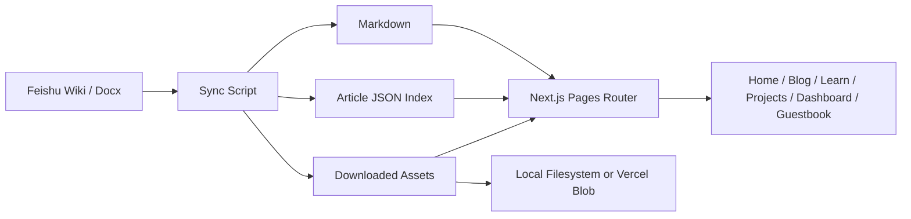

<h1 align="center">Feishu NextJS Blog</h1>

<p align="center">
  <a href="https://github.com/BlackishGreen33/Feishu-NextJS-Blog"></a>
  <a href="./LICENSE"></a>
  <a href="https://nextjs.org/"></a>
  <a href="https://react.dev/"></a>
  <a href="https://www.typescriptlang.org/"></a>
  <a href="https://tailwindcss.com/"></a>
  <a href="https://open.feishu.cn/"></a>
  <a href="https://vercel.com/docs/vercel-blob"></a>
</p>

<p align="center">
  <a href="./README.md">繁體中文</a> · 简体中文 · <a href="./README.en.md">English</a>
</p>

<p align="center">
  一个以飞书知识库为内容来源的 Next.js 多语内容站示例，采用“同步后渲染”而不是前台直接嵌入飞书页面。
</p>

<p align="center">
  <a href="https://blog.blackishgreen.dpdns.org">Live Site</a>
  ·
  <a href="https://blackishgreen.vercel.app">Vercel Deployment</a>
  ·
  <a href="#亮点">亮点</a>
  ·
  <a href="#架构">架构</a>
  ·
  <a href="#快速开始">快速开始</a>
  ·
  <a href="#部署">部署</a>
</p>

<p align="center">
  
</p>

> [!IMPORTANT]
> 这个项目的核心设计是 `Feishu Wiki / Docx -> Markdown + JSON + Assets -> Next.js Rendering`。内容会先同步并标准化，再交给站点渲染，而不是把飞书页面直接嵌进前端。

## 为什么做这个项目

大多数把文档平台当作内容源的站点，最终都会遇到几个问题：

- 前台直接嵌入第三方文档，SEO、样式控制和加载体验都受限
- 内容结构散落在不同页面，首页、列表页和详情页很难复用同一套数据模型
- 图片、附件、frontmatter、内链与多语言路由往往没有被统一标准化

这个项目的目标，是提供一个更工程化的实现方式：保留飞书作为写作入口，同时让 Next.js 站点拥有自己的内容模型、资源管线和部署策略。

## 亮点

- 以飞书知识库空间作为内容来源，通过官方 API 同步 Wiki / Docx 内容
- 使用 `feishu-docx` 将 block JSON 转为 Markdown，并保留图片与附件下载能力
- 使用统一的 `Article` 模型供首页、博客列表和文章详情页复用
- 支持 `zh-TW`、`zh-CN`、`en` 三语路由及对应的 canonical / alternate SEO 配置
- 内建文章搜索、命令面板搜索与 `Cmd/Ctrl + K` 快捷入口
- 站点包含首页、Dashboard、Projects、Blog、Learn、About、Contact、Guestbook、Playground
- Guestbook / Chat Widget 可选配 Firebase Realtime Database
- 支持本地文件存储与 Vercel Blob 两种资源后端
- 通过 Vercel Cron 执行定时同步，避免前台请求时直连飞书

## 架构



## 技术栈

| 层级                 | 技术                                        |
| -------------------- | ------------------------------------------- |
| Framework            | Next.js 16, React 19, TypeScript            |
| Styling              | Tailwind CSS 4, Framer Motion, next-themes  |
| Content              | Feishu Open API, `feishu-docx`, gray-matter |
| Data Fetching        | SWR, Axios                                  |
| Storage              | Local filesystem, Vercel Blob               |
| Interactive Features | Firebase, command palette, JS playground    |
| Quality Gates        | ESLint, Prettier, TypeScript, Jest          |

## 项目结构

```text
.
├── data/feishu-blog/           # 同步后的文章索引和文章 JSON
├── public/feishu-assets/       # 下载后的封面图与文内资源
├── scripts/                    # 同步与仓库工具脚本
├── src/
│   ├── common/                 # 共享配置、布局、hooks、stores、UI helpers
│   ├── modules/                # 页面级功能模块
│   ├── pages/                  # Next.js 路由与 API endpoints
│   └── server/blog/            # 飞书同步、存储和仓储逻辑
├── README.md
├── README.zh-CN.md
└── README.en.md
```

## 快速开始

### 1. 安装依赖

```bash
pnpm install
```

### 2. 创建本地环境变量

```bash
cp .env.example .env.local
```

至少需要配置以下飞书同步相关变量：

```bash
NEXT_PUBLIC_SITE_URL=http://localhost:3000
SITE_URL=http://localhost:3000
IMAGE_REMOTE_HOSTS=

FEISHU_APP_ID=
FEISHU_APP_SECRET=
FEISHU_SPACE_ID=
```

### 3. 从飞书同步内容

```bash
pnpm feishu:sync
```

如果本地没有飞书凭证，应用会回退到仓库里已经提交的示例数据。

### 4. 启动开发服务器

```bash
pnpm dev
```

当飞书凭证已经配置完成时，`predev` 会在启动前尝试同步一次内容。

## 环境变量

| Variable                                                                | Required | Purpose                                |
| ----------------------------------------------------------------------- | -------- | -------------------------------------- |
| `NEXT_PUBLIC_SITE_URL`                                                  | Yes      | SEO、sitemap 与公开链接使用的站点 URL  |
| `SITE_URL`                                                              | Yes      | 服务端 canonical URL 兜底值            |
| `FEISHU_APP_ID`                                                         | Yes      | 飞书应用凭证                           |
| `FEISHU_APP_SECRET`                                                     | Yes      | 飞书应用凭证                           |
| `FEISHU_SPACE_ID`                                                       | Yes      | 目标飞书知识库 space                   |
| `BLOB_READ_WRITE_TOKEN`                                                 | Optional | 在生产环境启用 Vercel Blob             |
| `CRON_SECRET`                                                           | Optional | 保护定时同步接口                       |
| `NEXT_PUBLIC_FIREBASE_*`                                                | Optional | 启用 guestbook 与 chat widget          |
| `FIREBASE_ADMIN_*`                                                      | Optional | 启用 guestbook API 层与服务端校验      |
| `GUESTBOOK_ADMIN_UIDS`                                                  | Optional | 允许在留言板页执行隐藏/删除的 UID 列表 |
| `IMAGE_REMOTE_HOSTS`                                                    | Optional | 额外允许的远程图片 host 列表           |
| `CONTACT_FORM_API_KEY`                                                  | Optional | 联系表单发送密钥                       |
| `DEVTO_KEY`                                                             | Optional | dev.to 读取 API 密钥                   |
| `GITHUB_READ_USER_TOKEN_PERSONAL`                                       | Optional | GitHub GraphQL 读取 Token              |
| `SPOTIFY_CLIENT_ID` / `SPOTIFY_CLIENT_SECRET` / `SPOTIFY_REFRESH_TOKEN` | Optional | Spotify now playing 与设备数据         |
| `WAKATIME_API_KEY`                                                      | Optional | WakaTime 统计数据                      |
| `MINIMAX_SYSTEM_PROMPT`                                                 | Optional | Command Palette AI 的系统提示词        |

## 内容工作流

### Frontmatter

每篇飞书文档都可以在顶部写 YAML frontmatter：

```yaml
---
slug: feishu-sync-architecture
title: 飞书同步架构说明
date: 2026-04-17
tags: [Feishu, Next.js]
summary: 这篇文章展示了如何把飞书知识库同步为 Markdown，并由 Next.js 正常渲染。
cover: https://example.com/cover.png
featured: true
draft: false
---
```

### 支持字段

- `slug`
- `title`
- `date`
- `tags`
- `summary`
- `cover`
- `featured`
- `draft`

如果某些字段缺失，同步管线会回退到文档元数据、编辑时间、自动摘要或首张可用图片。

### 同步后会产出什么

- 用于列表页与详情页的标准化文章元数据
- 已经重写的文章内链
- 下载后的封面图与文内资源
- 可直接交给 `react-markdown` 渲染的 Markdown 内容

## 性能审计入口

如果你想跑一版新的外部性能测试，推荐使用这些公开 URL：

- 主域名: [https://blog.blackishgreen.dpdns.org](https://blog.blackishgreen.dpdns.org)
- 稳定部署域名: [https://blackishgreen.vercel.app](https://blackishgreen.vercel.app)

一键测速入口：

- 主域名
  - [PageSpeed Insights](https://pagespeed.web.dev/analysis?url=https%3A%2F%2Fblog.blackishgreen.dpdns.org%2F&form_factor=desktop)
  - [GTmetrix](https://gtmetrix.com/?url=https%3A%2F%2Fblog.blackishgreen.dpdns.org%2F)
- 稳定部署域名
  - [PageSpeed Insights](https://pagespeed.web.dev/analysis?url=https%3A%2F%2Fblackishgreen.vercel.app%2F&form_factor=desktop)
  - [GTmetrix](https://gtmetrix.com/?url=https%3A%2F%2Fblackishgreen.vercel.app%2F)

> [!NOTE]
> 外部性能报告会随着时间、节点位置、DNS 状态与防护策略变化，因此这份 README 以稳定的审计入口和目标 URL 为主，而不是固定一张很快过时的分数截图。如果你的网络环境对自定义域名解析不稳定，建议优先使用 Vercel 部署域名重新测试。

## 验证

在提交前，建议至少跑完这些检查：

```bash
pnpm lint
pnpm typecheck
pnpm test
pnpm build
```

常用脚本：

- `pnpm dev`
- `pnpm feishu:sync`
- `pnpm lint`
- `pnpm lint:fix`
- `pnpm typecheck`
- `pnpm test`
- `pnpm build`

## 部署

### Vercel

仓库里的 `vercel.json` 已经预置了定时任务：

- 端点：`/api/cron/feishu-sync`
- 默认频率：每 6 小时一次

推荐的生产环境配置：

- 飞书应用凭证
- `BLOB_READ_WRITE_TOKEN`
- `CRON_SECRET`
- 对外可访问的站点 URL 变量

## 鸣谢

- [Feishu Open Platform](https://open.feishu.cn/)
- [`feishu-docx`](https://www.npmjs.com/package/feishu-docx)
- [Next.js](https://nextjs.org/)
- [Vercel](https://vercel.com/)

## 许可证

本项目基于 [GPL-3.0](./LICENSE) 开源。
